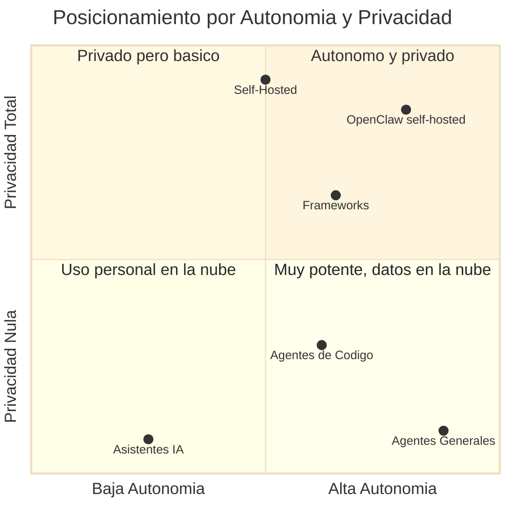
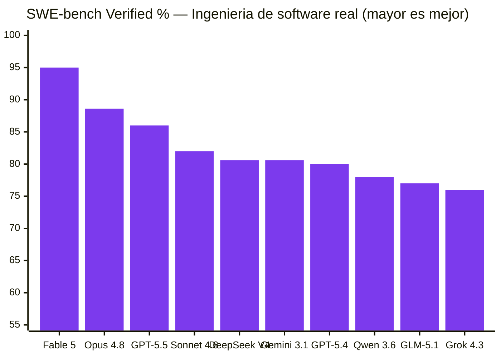
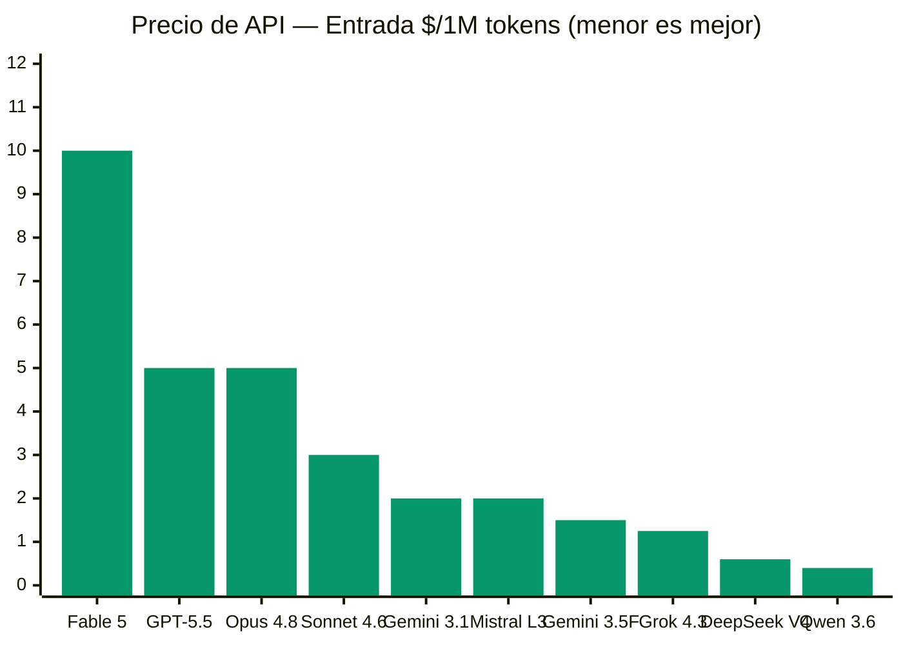
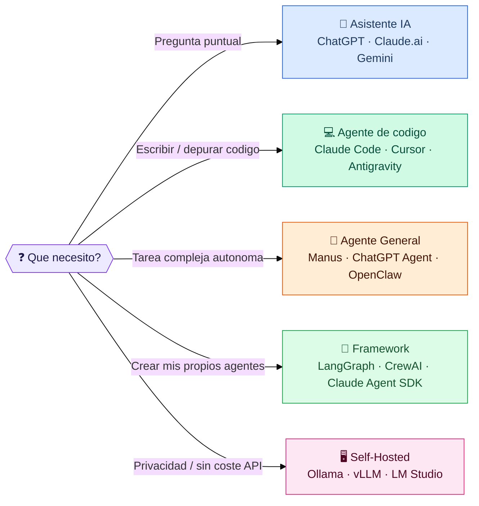

# 🌐 Panorama Global de la IA — 2026

> Informe interactivo del ecosistema de Inteligencia Artificial para el **Master en IA Aplicada**.  
> Benchmarks, precios, comparativas y más de 40 herramientas organizadas en 6 capas. **Actualizado: junio 2026.**

🔗 **[Ver informe en vivo → pjbarberoiglesias.github.io/Panorama-IA](https://pjbarberoiglesias.github.io/Panorama-IA/)**

---

## 🗺️ El Ecosistema IA en 6 Capas

```mermaid
%%{init: {'theme': 'base', 'themeVariables': {'primaryColor': '#f0f4ff', 'edgeLabelBackground': '#ffffff'}}}%%
flowchart TB
    subgraph L6["🖥️ CAPA 6 — Infraestructura Self-Hosted  |  PRIVACIDAD TOTAL"]
        direction LR
        Ollama["🦙 Ollama ⭐"] --- vLLM["🚄 vLLM"] --- LMStudio["🎛️ LM Studio"] --- JanAI["🌙 Jan.ai"] --- llamacpp["⚙️ llama.cpp"]
    end
    subgraph L5["🔧 CAPA 5 — Frameworks de Agentes & MCP  |  DEV / TÉCNICO"]
        direction LR
        LangGraph["🔗 LangGraph ⭐"] --- CrewAI["👥 CrewAI"] --- MSAF["🔄 MS Agent Framework"] --- ClaudeSDK["🟠 Claude Agent SDK"] --- MCP["🔌 MCP ⭐"]
    end
    subgraph L4["🤖 CAPA 4 — Agentes IA Generales  |  ALTA AUTONOMÍA"]
        direction LR
        Manus["🤖 Manus ⭐"] --- ChatGPTAgent["🌐 ChatGPT Agent"] --- OpenClaw["🦞 OpenClaw"] --- ManagedAgents["🟠 Managed Agents"] --- DeepR["🔬 Deep Research"]
    end
    subgraph L3["💻 CAPA 3 — IDEs con IA & Agentes de Código  |  DEV / CÓDIGO"]
        direction LR
        CC["⌨️ Claude Code ⭐"] --- AG["🚀 Antigravity 2.0 ⭐"] --- Cursor["🖱️ Cursor"] --- Codex["📦 Codex"] --- DevinD["🏄 Devin Desktop"]
    end
    subgraph L2["💬 CAPA 2 — Asistentes IA  |  REACTIVOS → AGÉNTICOS"]
        direction LR
        ChatGPT["🟢 ChatGPT"] --- ClaudeAI["🟠 Claude.ai"] --- GeminiA["🔷 Gemini"] --- Copilot["🟣 Copilot"] --- Perp["🔍 Perplexity"]
    end
    subgraph L1["🧠 CAPA 1 — Modelos Fundacionales  |  CAPA BASE"]
        direction LR
        Cl["Claude Fable 5 / Opus 4.8"] --- GPT["GPT-5.5"] --- Gem["Gemini 3.1 Pro"] --- DS["DeepSeek V4"] --- Kimi["Kimi K2.6"]
    end

    L1 --> L2
    L1 --> L3
    L6 --> L1

    style L1 fill:#ede9fe,stroke:#7c3aed,color:#1e1b4b
    style L2 fill:#dbeafe,stroke:#2563eb,color:#1e3a5f
    style L3 fill:#d1fae5,stroke:#059669,color:#064e3b
    style L4 fill:#ffedd5,stroke:#ea580c,color:#431407
    style L5 fill:#dcfce7,stroke:#16a34a,color:#14532d
    style L6 fill:#fce7f3,stroke:#db2777,color:#500724
```



---

## 📊 Autonomía vs Privacidad



---

## 🧠 Árbol del Ecosistema

```mermaid
mindmap
  root((🌐 Ecosistema IA 2026))
    🧠 Modelos LLM
      Anthropic
        Claude Fable 5 ⭐
        Claude Opus 4.8
        Claude Sonnet 4.6
        Claude Haiku 4.5
      OpenAI
        GPT-5.5 / 5.5 Pro
        GPT-5.4 / mini
      Google
        Gemini 3.1 Pro (2M ctx)
        Gemini 3.5 Flash
      xAI
        Grok 4.3
      Open Weights
        DeepSeek V4 Pro/Flash
        Kimi K2.6
        Qwen 3.6
        GLM-5.1
        Llama 4
        Mistral Large 3 🇪🇺
    💬 Asistentes
      ChatGPT (Agent mode)
      Claude.ai
      Gemini
      Microsoft Copilot
      Perplexity + Comet
      Grok
    💻 IDEs & Agentes de Código
      Claude Code ⭐
      Antigravity 2.0 ⭐
      Cursor
      Codex (OpenAI)
      GitHub Copilot
      Devin / Devin Desktop
      Kiro · Zed · Aider · Junie
    🤖 Agentes Generales
      Manus ⭐
      ChatGPT Agent
      OpenClaw 🦞
      Claude Managed Agents
      Gemini Deep Research
    🔧 Frameworks
      LangChain / LangGraph
      CrewAI
      MS Agent Framework
      OpenAI Agents SDK
      Claude Agent SDK
      Google ADK
      MCP (estándar) ⭐
    🖥️ Self-Hosted
      Ollama ⭐
      vLLM
      LM Studio
      Jan.ai · LocalAI
      llama.cpp
```

---

## 🧪 Benchmarks de Modelos LLM



---

## 💰 Precios de API (entrada, $/1M tokens)



---

## 🎯 ¿Qué herramienta usar?



---

## 📁 Estructura del Proyecto

```
Panorama-IA/
├── index.html          ← Informe interactivo principal
├── README.md           ← Este archivo (con diagramas Mermaid)
└── assets/
    ├── panorama_ia_2026_resumen.md     ← Resumen en Markdown
    └── panorama_ia_2026_*.png          ← Infografía (PNG)
```

## 🚀 Secciones del Informe Interactivo

| # | Sección | Contenido |
|---|---------|-----------|
| 1 | 🗺️ Resumen | Las 6 capas del ecosistema IA con tooltips |
| 2 | 🧠 Modelos LLM | 17 modelos con benchmarks ordenables (MMLU-Pro, GPQA Diamond, LiveCodeBench, AIME, SWE-bench Verified) |
| 3 | 🛠️ Herramientas | 40+ herramientas en 5 categorías con filtros |
| 4 | 💰 Precios | Suscripciones y precios de API de todos los proveedores |
| 5 | 📊 Matriz Comparativa | Selección y comparación lado a lado de 2+ elementos |

## 📅 Historial de Versiones

| Fecha | Versión | Cambios |
|-------|---------|---------|
| Junio 2026 | v1.0 | Creación inicial del informe interactivo |
| Junio 2026 | v1.1 | Publicación en GitHub Pages + README con Mermaid |
| Junio 2026 | v2.0 | Actualización completa: 17 modelos (Claude Fable 5, GPT-5.5, Gemini 3.1...), nuevas herramientas (Antigravity 2.0, Devin Desktop, Kiro, MCP...), precios y benchmarks de junio 2026 |

---

> ⚠️ El ecosistema IA evoluciona muy rápido. Esta foto es de **junio 2026**.  
> Repositorio: [github.com/pjbarberoiglesias/Panorama-IA](https://github.com/pjbarberoiglesias/Panorama-IA)
