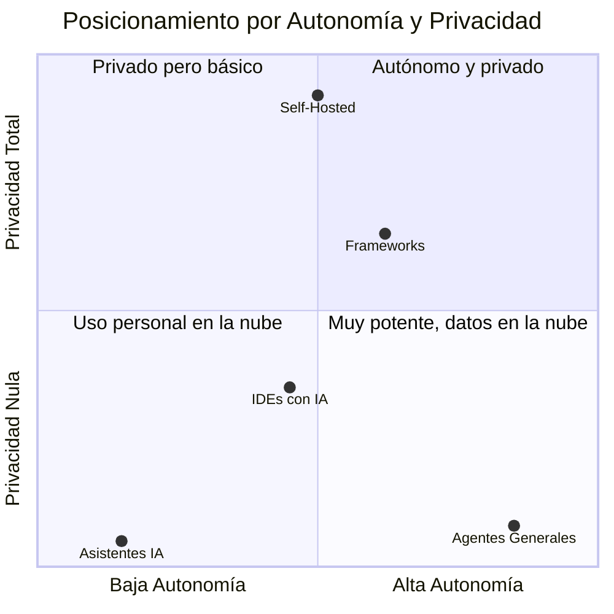
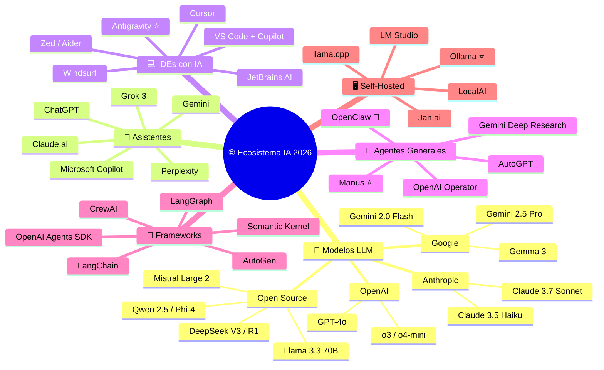
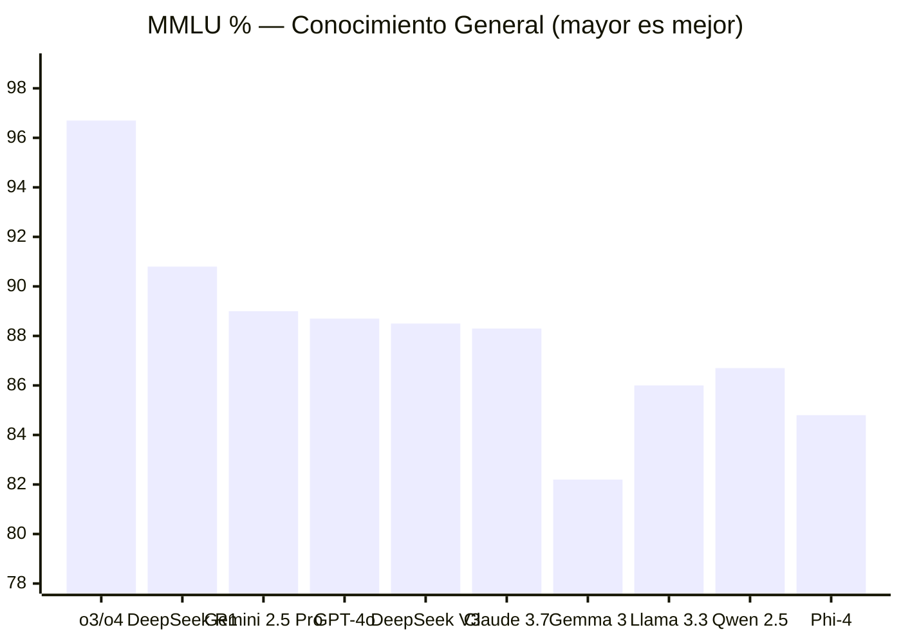
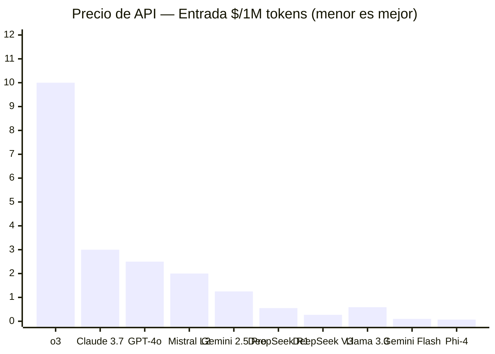
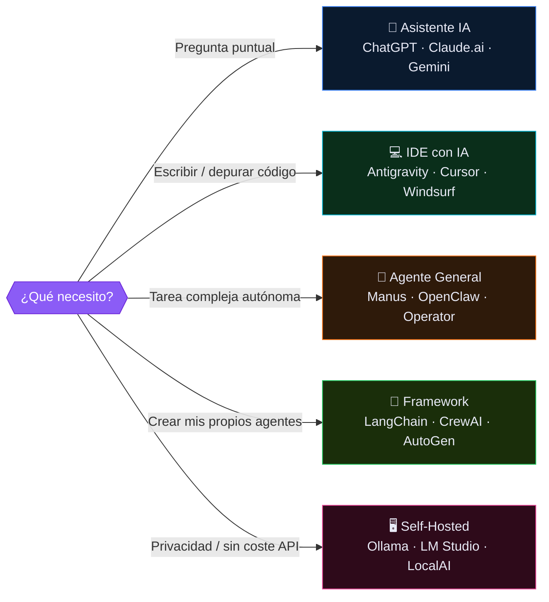

# 🌐 Panorama Global de la IA — 2026

> Informe interactivo del ecosistema de Inteligencia Artificial para el **Master en IA Aplicada**.  
> Benchmarks, precios, comparativas y más de 40 herramientas organizadas en 6 capas.

🔗 **[Ver informe en vivo → pjbarberoiglesias.github.io/Panorama-IA](https://pjbarberoiglesias.github.io/Panorama-IA/)**

---

## 🗺️ El Ecosistema IA en 6 Capas

```mermaid
flowchart TB
    subgraph L6["🖥️ CAPA 6 — Infraestructura Self-Hosted  |  PRIVACIDAD TOTAL"]
        direction LR
        Ollama["🦙 Ollama ⭐"] --- LMStudio["🎛️ LM Studio"] --- LocalAI["🏠 LocalAI"] --- JanAI["🌙 Jan.ai"] --- llamacpp["⚙️ llama.cpp"]
    end
    subgraph L5["🔧 CAPA 5 — Frameworks Multi-Agente  |  DEV / TÉCNICO"]
        direction LR
        LangChain["🔗 LangChain"] --- LangGraph["📊 LangGraph"] --- CrewAI["👥 CrewAI"] --- AutoGen["🔄 AutoGen"] --- SK["🎯 Semantic Kernel"]
    end
    subgraph L4["🤖 CAPA 4 — Agentes IA Generales  |  ALTA AUTONOMÍA"]
        direction LR
        Manus["🤖 Manus ⭐"] --- OpenClaw["🦞 OpenClaw ⭐"] --- Operator["🌐 Operator"] --- DeepR["🔬 Deep Research"]
    end
    subgraph L3["💻 CAPA 3 — IDEs con IA & Agentes de Código  |  DEV / CÓDIGO"]
        direction LR
        AG["🚀 Antigravity ⭐"] --- Cursor["🖱️ Cursor"] --- WS["🏄 Windsurf"] --- CC["⌨️ Claude Code"] --- Codex["📦 Codex"]
    end
    subgraph L2["💬 CAPA 2 — Asistentes IA  |  REACTIVOS"]
        direction LR
        ChatGPT["🟢 ChatGPT"] --- ClaudeAI["🟠 Claude.ai"] --- GeminiA["🔷 Gemini"] --- Copilot["🟣 Copilot"] --- Perp["🔍 Perplexity"]
    end
    subgraph L1["🧠 CAPA 1 — Modelos Fundacionales  |  CAPA BASE"]
        direction LR
        GPT["GPT-4o/o3"] --- Cl["Claude 3.7"] --- Gem["Gemini 2.5"] --- Ll["Llama 3.3"] --- DS["DeepSeek V3/R1"]
    end

    L1 --> L2
    L1 --> L3
    L6 --> L1

    style L1 fill:#1a0a2e,stroke:#8b5cf6,color:#e8eaf6
    style L2 fill:#0a1a2e,stroke:#3b82f6,color:#e8eaf6
    style L3 fill:#0a2e1a,stroke:#06b6d4,color:#e8eaf6
    style L4 fill:#2e1a0a,stroke:#f97316,color:#e8eaf6
    style L5 fill:#1a2e0a,stroke:#22c55e,color:#e8eaf6
    style L6 fill:#2e0a1a,stroke:#ec4899,color:#e8eaf6
```



---

## 📊 Autonomía vs Privacidad



---

## 🧠 Árbol del Ecosistema



---

## 🧪 Benchmarks de Modelos LLM



---

## 💰 Precios de API (entrada, $/1M tokens)



---

## 🎯 ¿Qué herramienta usar?



---

## 📁 Estructura del Proyecto

```
1.Panorama IA/
├── index.html          ← Informe interactivo principal
├── README.md           ← Este archivo (con diagramas Mermaid)
└── assets/
    ├── panorama_ia_2026_resumen.md     ← Resumen en Markdown
    ├── panorama_ia_2026_*.png          ← Infografía (PNG)
    ├── panorama_ia_infografia_*.webp   ← Infografía completa
    └── panorama_ia_preview_*.webp      ← Preview del diagrama
```

## 🚀 Secciones del Informe Interactivo

| # | Sección | Contenido |
|---|---------|-----------|
| 1 | 🗺️ Resumen | Las 6 capas del ecosistema IA con tooltips |
| 2 | 🧠 Modelos LLM | 14 modelos con benchmarks ordenables (MMLU, GPQA, HumanEval, MATH, SWE-bench) |
| 3 | 🛠️ Herramientas | 40+ herramientas en 5 categorías con filtros |
| 4 | 💰 Precios | Suscripciones y precios de API de todos los proveedores |
| 5 | 📊 Matriz Comparativa | Selección y comparación lado a lado de 2+ elementos |

## 📅 Historial de Versiones

| Fecha | Versión | Cambios |
|-------|---------|---------|
| Junio 2026 | v1.0 | Creación inicial del informe interactivo |
| Junio 2026 | v1.1 | Publicación en GitHub Pages + README con Mermaid |

---

> ⚠️ El ecosistema IA evoluciona muy rápido. Esta foto es de **junio 2026**.  
> Repositorio: [github.com/pjbarberoiglesias/Panorama-IA](https://github.com/pjbarberoiglesias/Panorama-IA)
