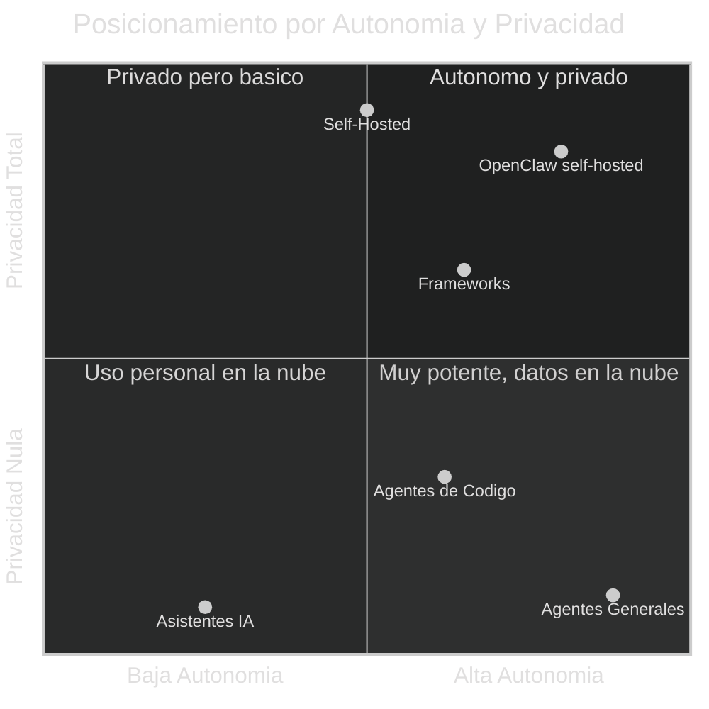
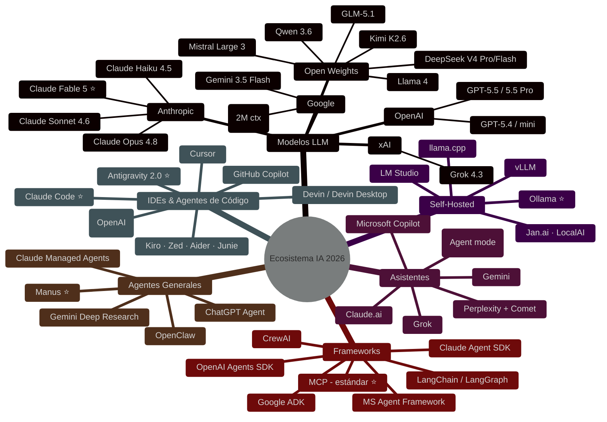
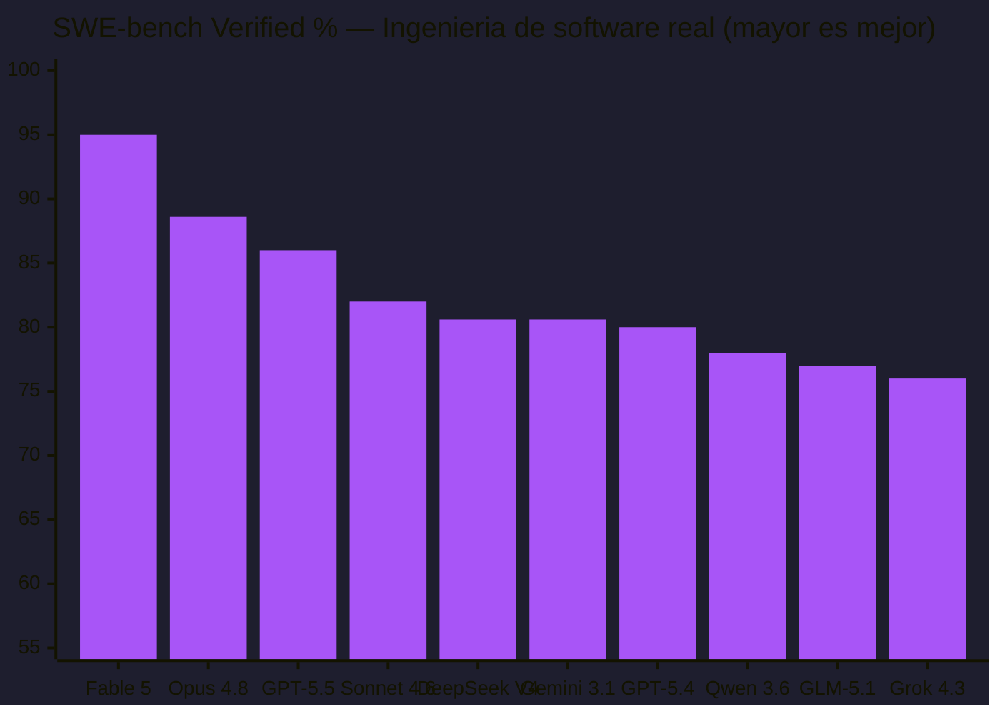
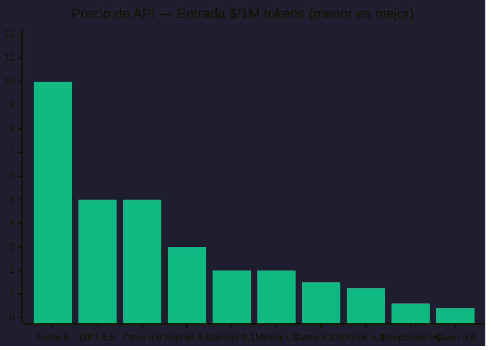
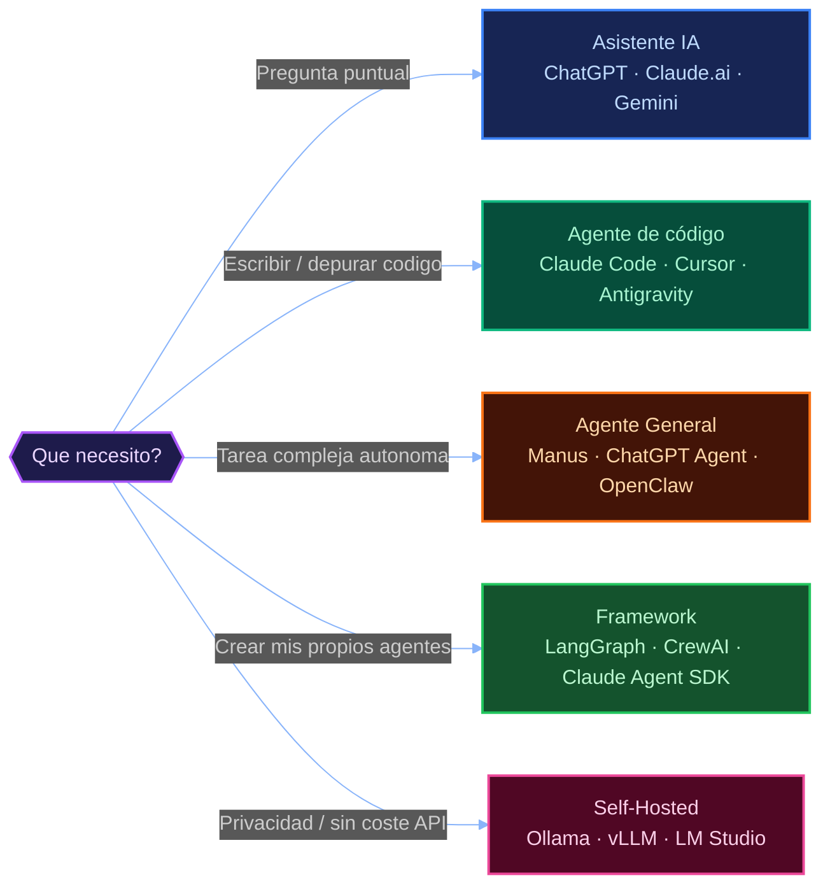

# Panorama Global de la IA — 2026


> Informe interactivo del ecosistema de Inteligencia Artificial para el **Master en IA Aplicada**.  
> Benchmarks, precios, comparativas y más de 40 herramientas organizadas en 6 capas. **Actualizado: junio 2026.**

🔗 **[Ver informe en vivo → pjbarberoiglesias.github.io/Panorama-IA](https://pjbarberoiglesias.github.io/Panorama-IA/)**

---

## Póster del Ecosistema

> Infografía resumen de las 6 capas en una sola imagen. El informe interactivo incluye además una pestaña **Infografías** con liga de benchmarks, mapa de precios, cuadrante autonomía/privacidad e hitos del año.


---

## El Ecosistema IA en 6 Capas

```mermaid
%%{init: {'theme': 'dark', 'themeVariables': {'primaryColor': '#1e1e2e', 'edgeLabelBackground': '#1e1e2e', 'lineColor': '#89b4fa'}}}%%
flowchart TB
    subgraph L6["CAPA 6 — Infraestructura Self-Hosted  |  PRIVACIDAD TOTAL"]
        direction LR
        Ollama["Self-Hosted\nOllama ⭐"] --- vLLM["Self-Hosted\nvLLM"] --- LMStudio["Self-Hosted\nLM Studio"] --- JanAI["Self-Hosted\nJan.ai"] --- llamacpp["Self-Hosted\nllama.cpp"]
    end
    subgraph L5["CAPA 5 — Frameworks de Agentes & MCP  |  DEV / TÉCNICO"]
        direction LR
        LangGraph["Framework\nLangGraph ⭐"] --- CrewAI["Framework\nCrewAI"] --- MSAF["Framework\nMS Agent Framework"] --- ClaudeSDK["Framework\nClaude Agent SDK"] --- MCP["Protocolo\nMCP ⭐"]
    end
    subgraph L4["CAPA 4 — Agentes IA Generales  |  ALTA AUTONOMÍA"]
        direction LR
        Manus["Agente\nManus ⭐"] --- ChatGPTAgent["Agente\nChatGPT Agent"] --- OpenClaw["Agente\nOpenClaw"] --- ManagedAgents["Agente\nManaged Agents"] --- DeepR["Agente\nDeep Research"]
    end
    subgraph L3["CAPA 3 — IDEs con IA & Agentes de Código  |  DEV / CÓDIGO"]
        direction LR
        CC["IDE & Agente\nClaude Code ⭐"] --- AG["IDE & Agente\nAntigravity 2.0 ⭐"] --- Cursor["IDE & Agente\nCursor"] --- Codex["IDE & Agente\nCodex"] --- DevinD["IDE & Agente\nDevin Desktop"]
    end
    subgraph L2["CAPA 2 — Asistentes IA  |  REACTIVOS → AGÉNTICOS"]
        direction LR
        ChatGPT["Asistente\nChatGPT"] --- ClaudeAI["Asistente\nClaude.ai"] --- GeminiA["Asistente\nGemini"] --- Copilot["Asistente\nCopilot"] --- Perp["Asistente\nPerplexity"]
    end
    subgraph L1["CAPA 1 — Modelos Fundacionales  |  CAPA BASE"]
        direction LR
        Cl["Modelo\nClaude Fable 5 / Opus 4.8"] --- GPT["Modelo\nGPT-5.5"] --- Gem["Modelo\nGemini 3.1 Pro"] --- DS["Modelo\nDeepSeek V4"] --- Kimi["Modelo\nKimi K2.6"]
    end

    L1 --> L2
    L1 --> L3
    L6 --> L1

    style L1 fill:#1e1b4b,stroke:#a855f7,color:#e9d5ff,stroke-width:2px
    style L2 fill:#172554,stroke:#3b82f6,color:#bfdbfe,stroke-width:2px
    style L3 fill:#064e3b,stroke:#10b981,color:#a7f3d0,stroke-width:2px
    style L4 fill:#431407,stroke:#f97316,color:#fed7aa,stroke-width:2px
    style L5 fill:#14532d,stroke:#22c55e,color:#bbf7d0,stroke-width:2px
    style L6 fill:#500724,stroke:#ec4899,color:#fbcfe8,stroke-width:2px
```



---

## Autonomía vs Privacidad



---

## Árbol del Ecosistema



---

## Benchmarks de Modelos LLM



---

## Precios de API (entrada, $/1M tokens)



---

## ¿Qué herramienta usar?



---

## Estructura del Proyecto

```
Panorama-IA/
├── index.html          ← Informe interactivo principal
├── README.md           ← Este archivo (con diagramas Mermaid)
└── assets/
    ├── panorama_ia_2026_resumen.md        ← Resumen en Markdown
    ├── infografia_ecosistema_2026.svg     ← Póster del ecosistema (SVG)
    └── panorama_ia_2026_*.png             ← Infografía (PNG)
```

## Secciones del Informe Interactivo

| # | Sección | Contenido |
|---|---------|-----------|
| 1 | Resumen | Las 6 capas del ecosistema IA con tooltips |
| 2 | Modelos LLM | 17 modelos con benchmarks ordenables (MMLU-Pro, GPQA Diamond, LiveCodeBench, AIME, SWE-bench Verified) |
| 3 | Herramientas | 40+ herramientas en 5 categorías con filtros |
| 4 | Precios | Suscripciones y precios de API de todos los proveedores |
| 5 | Matriz Comparativa | Selección y comparación lado a lado de 2+ elementos |
| 6 | Infografías | Póster del ecosistema, liga de benchmarks, mapa de precios, cuadrante autonomía/privacidad e hitos de 2026 |

## Historial de Versiones

| Fecha | Versión | Cambios |
|-------|---------|---------|
| Junio 2026 | v1.0 | Creación inicial del informe interactivo |
| Junio 2026 | v1.1 | Publicación en GitHub Pages + README con Mermaid |
| Junio 2026 | v2.0 | Actualización completa: 17 modelos (Claude Fable 5, GPT-5.5, Gemini 3.1...), nuevas herramientas (Antigravity 2.0, Devin Desktop, Kiro, MCP...), precios y benchmarks de junio 2026 |
| Junio 2026 | v2.1 | Nueva pestaña Infografías (póster del ecosistema, liga de benchmarks, mapa de precios, cuadrante autonomía/privacidad, hitos del año) + póster SVG en assets |

---

> El ecosistema IA evoluciona muy rápido. Esta foto es de **junio 2026**.  
> Repositorio: [github.com/pjbarberoiglesias/Panorama-IA](https://github.com/pjbarberoiglesias/Panorama-IA)
