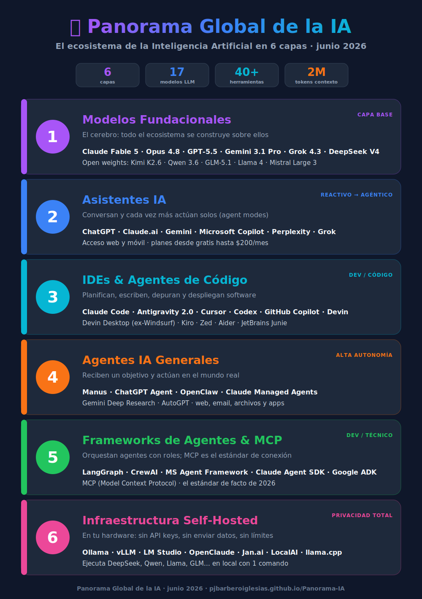

# El Panorama Global de la IA — 2026



> **Actualizado: junio 2026**

---

## Las 6 Capas del Ecosistema IA

### CAPA 1 — Modelos Fundacionales
> *El cerebro. Todo lo demás se construye sobre ellos.*

| Modelo | Empresa | Tipo | API ($/1M in/out) |
|---|---|---|---|
| Claude Fable 5 ⭐ | Anthropic | Propietario | $10 / $50 |
| Claude Opus 4.8 | Anthropic | Propietario | $5 / $25 |
| GPT-5.5 / 5.4 | OpenAI | Propietario | $5/$30 · $2.5/$15 |
| Gemini 3.1 Pro (2M ctx) | Google | Propietario | $2 / $12 |
| Gemini 3.5 Flash | Google | Propietario | $1.5 / $9 |
| Grok 4.3 | xAI | Propietario | $1.25 / $2.50 |
| DeepSeek V4 Pro ⭐ | DeepSeek | **Open weights (MIT)** | ~$0.6 / $2.5 |
| Kimi K2.6 | Moonshot AI | **Open weights** | ~$0.6 / $2.5 |
| Qwen 3.6 | Alibaba | **Open weights (Apache 2.0)** | ~$0.4 / $1.6 |
| GLM-5.1 | Zhipu AI | **Open weights (MIT)** | ~$0.6 / $2.2 |
| Llama 4 | Meta | Open weights (⚠️ no UE) | ~$0.27 / $0.85 |
| Mistral Large 3 | Mistral AI | **Open weights (Apache 2.0)** | $2 / $6 |

**Claves de 2026:** Claude Fable 5 lidera SWE-bench Verified (95%); Gemini 3.1 Pro tiene el mayor contexto (2M tokens); los open weights chinos (DeepSeek, Kimi, Qwen, GLM) dominan la gama abierta; Mistral es la opción europea/RGPD.

---

### CAPA 2 — Asistentes IA (cada vez más agénticos)
> *Responden cuando les preguntas... y ya empiezan a actuar solos (agent modes).*

| Asistente | Empresa | Acceso |
|---|---|---|
| ChatGPT (GPT-5.5 + Agent mode) | OpenAI | Web/App — Free, Go $8, Plus $20, Pro $200 |
| Claude.ai (Fable 5 / Opus 4.8) | Anthropic | Web/App — Free, Pro $20, Max $100/$200 |
| Gemini (3.1 Pro) | Google | Web/App — Free, AI Pro $19.99, Ultra $99.99 |
| Microsoft Copilot | Microsoft | Windows/Office |
| Perplexity + navegador Comet | Perplexity AI | Web/App — Pro $20, Max $200 |
| Grok (4.3) | xAI | X/Web/App |

---

### CAPA 3 — IDEs con IA & Agentes de Código
> *Integrados en el editor o terminal. Escriben, depuran y despliegan software.*

| Herramienta | Empresa | Integración |
|---|---|---|
| ⭐ **Claude Code** | Anthropic | Terminal + IDE + Desktop + Web |
| ⭐ **Antigravity 2.0** | Google | Suite multi-agente + CLI + SDK |
| **Cursor** | Anysphere | IDE propio (fork VS Code) |
| **Codex** | OpenAI | CLI + IDE + nube (incluido en Plus) |
| **GitHub Copilot** | GitHub/Microsoft | VS Code + web (agent mode) |
| **Devin Desktop** (ex Windsurf) | Cognition | IDE propio (rebrand jun 2026) |
| **Devin** | Cognition | Agente autónomo — desde $20 |
| **Kiro** | AWS | IDE spec-driven |
| **Zed / Aider / Junie** | OSS / JetBrains | Editor Rust / CLI / IDEs JetBrains |

**Diferencia clave entre ellos:**
- `Claude Code / Codex / Aider` → Agentes de terminal/nube, máxima autonomía
- `Cursor / Devin Desktop / Zed / Kiro` → IDEs con agente integrado
- `Antigravity 2.0` → Suite multi-agente de Google (desktop + CLI + SDK)
- `Devin` → El más autónomo: trabaja solo durante horas

---

### CAPA 4 — Agentes IA Generales (Autónomos)
> *Reciben un objetivo y actúan en el mundo real: web, email, archivos, apps...*

| Agente | Empresa | Destacado por |
|---|---|---|
| ⭐ **Manus** | Manus AI | Referente en trabajo tipo analista; desktop app "My Computer" |
| **ChatGPT Agent** | OpenAI | Fusión Operator + Deep Research; navega y ejecuta |
| **OpenClaw** | @steipete | Open source, vive en WhatsApp/Telegram, memoria 24/7 |
| **Claude Managed Agents** | Anthropic | Agentes por API: el proveedor ejecuta el loop en sandbox |
| **Gemini Deep Research** | Google | Investigación profunda autónoma |
| **AutoGPT** | Significant Gravitas | Open source, pionero (2023) |

---

### CAPA 5 — Frameworks de Agentes & Protocolos
> *Para desarrolladores. Permiten crear equipos de agentes IA con roles distintos.*

| Framework | Uso |
|---|---|
| **LangChain / LangGraph** ⭐ | El stack con más producción (~400 empresas: Uber, LinkedIn, Klarna...) |
| **CrewAI** | Equipos de agentes con roles — la curva más baja |
| **Microsoft Agent Framework** | Fusión AutoGen + Semantic Kernel (GA abril 2026) |
| **OpenAI Agents SDK / AgentKit** | SDK oficial de OpenAI + builder visual |
| **Claude Agent SDK** | El SDK de Claude Code; integración MCP más profunda |
| **Google ADK** | El más fuerte en agentes multimodales; protocolo A2A |
| **MCP** ⭐ | El estándar de facto para conectar agentes con herramientas |

---

### CAPA 6 — Infraestructura Self-Hosted
> *Ejecuta modelos en tu propia máquina. Sin API keys, sin límites, sin enviar datos.*

| Herramienta | Destacado |
|---|---|
| **Ollama** ⭐ | El más popular. Corre DeepSeek, Qwen, Llama... con 1 comando |
| **vLLM** | El motor estándar para servir LLMs en producción con GPU |
| **LM Studio** | Interfaz gráfica para correr modelos localmente |
| **OpenClaude** | Servidor en Rust, alta performance, API compatible con OpenAI |
| **Jan.ai / LocalAI** | Alternativas OSS con API compatible OpenAI |
| **llama.cpp** | La base C++ de todo el ecosistema local |

---

## ¿Dónde encaja cada cosa?

```
PREGUNTA RÁPIDA → Asistente IA (ChatGPT, Claude.ai, Gemini)
DESARROLLO DE SOFTWARE → Agente de código (Claude Code, Cursor, Antigravity)
TAREA COMPLEJA DEL MUNDO REAL → Agente General (Manus, ChatGPT Agent, OpenClaw)
AUTOMATIZAR CON TU CÓDIGO → Framework (LangGraph, CrewAI, Claude Agent SDK)
PRIVACIDAD / SIN COSTE API → Self-hosted (Ollama, vLLM, LM Studio)
```

## 📊 Ejes de Comparación

| | Autonomía | Privacidad | Especialidad |
|---|---|---|---|
| Asistentes | 🟡 Media (agent modes) | 🔴 Nula | General |
| Agentes de código | 🟢 Alta | 🟡 Media | **Código** |
| Agentes Generales | 🟢 Alta | 🔴 Nula | **Todo** |
| Self-hosted | 🟡 Media | 🟢 Total | Flexible |

## 📈 Tendencias de junio 2026

- Los agentes de código trabajan **horas sin supervisión** (Claude Fable 5, Devin, Codex cloud).
- **MCP** se consolida como estándar universal para conectar agentes con herramientas y datos.
- Los **open weights chinos** (DeepSeek V4, Kimi K2.6, Qwen 3.6, GLM-5.1) dominan la gama abierta; Meta vira a closed-source.
- **Agentes gestionados en la nube**: el proveedor ejecuta el loop (Claude Managed Agents, Codex cloud, deployments programados).
- **Guerra de precios**: salida desde $2.50/1M (Grok 4.3) y contexto de hasta 2M tokens (Gemini 3.1 Pro).

---

> **Nota:** El ecosistema evoluciona muy rápido. Esta foto es de **junio 2026**.
